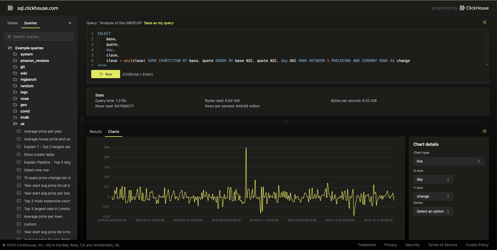
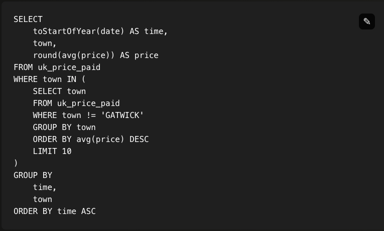

# Playground



This repository contains the example queries used across all our documentation and blogs, it also contains the script to set up the users. 

Users can raise UI issues in this repository and suggest example queries.

## What is the Playground?

The [Playground](https://sql.clickhouse.com) powers the example you see when reading the ClickHouse [documentation](https://clickhouse.com/docs) or [blogs](https://clickhouse.com/blog). 

Each time you see in the blogs a widget showing a SQL query with the  icon, you can click on it to open the Playground where you can run the query or build a simple visualization.



## Contributing example queries

Fork this repository and raise a PR on the [queries.json](./queries.json) file. Once the PR is approved, this query will be deployed to the ClickHouse instance (currently manually).

Make sure to not modify the id of existing queries.

## Reporting UI or Performance issues with Playground

Raise an issue in this repository using the relevant template.

## Direct connections

Users can connect directly to the ClickHouse instance using the [ClickHouse Client](https://clickhouse.com/docs/en/interfaces/cli).

```bash
clickhouse client --host sql-clickhouse.clickhouse.com --secure --user demo --password ''
```

## Load scripts [WIP]

This [folder](./load_scripts) contains the scripts use to keep the data in the playground up to date. We rely on Google Cloud Run to execute the scripts. 

Each folder contains a `Dockerfile`, a bash script to ingest the data and a `deploy.sh` script to deploy it as a Cloud Run job. Each job relies on environment variables to run that are listed in the individual folder.


